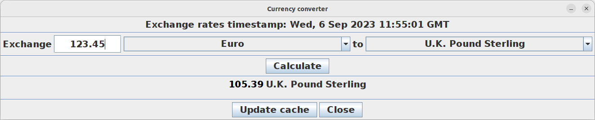

# Currency converter client

This repository contains the client part of my currency converter. It is written in Java, utilizing Swing as a GUI
framework.

Server repository and further description is available at:

https://github.com/adam-choragwicki/CurrencyConverter_Server_Cplusplus

# Prerequisites

* Java RE (minimum version 8)

# How to run the client

1. Download the latest release
2. Unzip
3. Run **start_currency_converter_client.sh**
